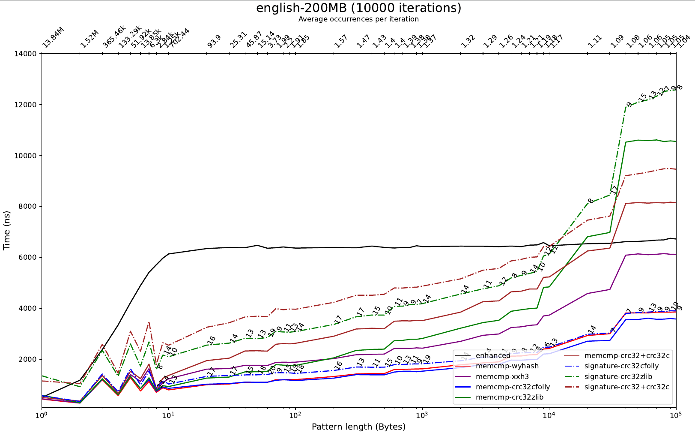

# Applications of Zuffix Arrays to String Search
A very fast full-text index data structure.

## Tests and benchmarks
Install [googletest], [benchmark], and the dependencies of [folly]; then, fetch and
compile all the other dependencies with `./makedeps.sh`. We suggest you to check
if hardware accelerated CRC32 is supported, calling
`CRC32CFollyHash::is_hw_supported()`.

You can automatically download and extract the Pizza&Chili corpus with
`./maketexts.sh`.

- `make test`: run all the tests.
- `make benchmark`: compile all the benchmarks.

The binaries that use Google Test and Google Benchmark allow for some some
(optional) command line arguments, for more information try `--help`.

## A quick performance overview

More results are available in the `blew` directory.

## Reference
Paolo Boldi and Sebastiano Vigna. Kings, name days, lazy servants and magic. In
Hiro Ito, Stefano Leonardi, Linda Pagli, and Giuseppe Prencipe, editors, 9th
International Conference on Fun with Algorithms (FUN 2018), volume 100 of
Leibniz International Proceedings in Informatics (LIPIcs), pages 10:1−10:13,
Dagstuhl, Germany, 2018. Schloss Dagstuhl−Leibniz-Zentrum fuer Informatik.
([url](http://drops.dagstuhl.de/opus/volltexte/2018/8801/pdf/LIPIcs-FUN-2018-10.pdf))
([sux4j](http://sux4j.di.unimi.it/))

[googletest]: https://github.com/google/googletest "GoogleTest - Google Testing and Mocking Framework"
[benchmark]: https://github.com/google/benchmark "google/benchmark: A microbenchmark support library"
[folly]: https://github.com/facebook/folly "Folly: Facebook Open-source Library"
